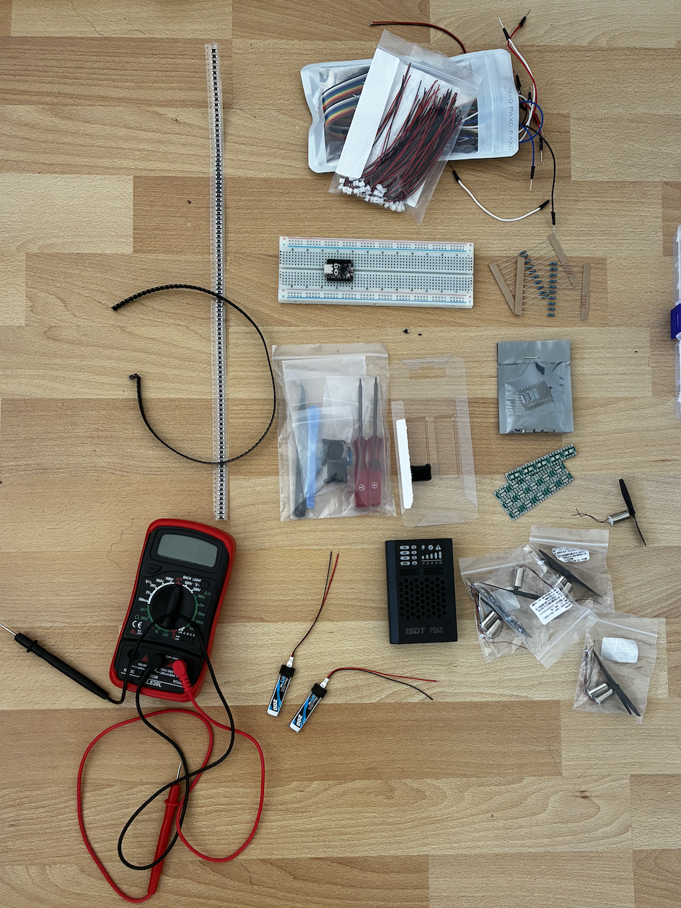
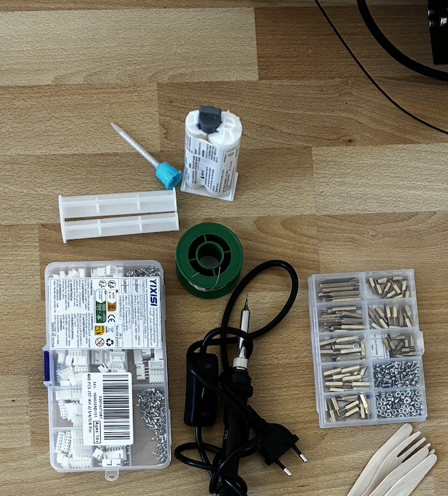
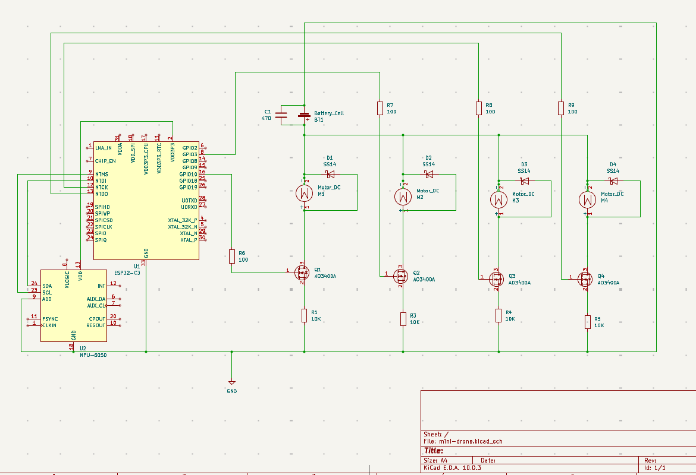

# Micro Drone & Custom Remote

A small quadcopter and its own remote, built from scratch: flight electronics,
brushed-motor driving, a wireless link, and power. 
The frame is being prototyped from wooden sticks.

## What it is

A micro / tiny-whoop-class drone built end to end to learn the whole stack: motor
driving, real-time control, a radio link, power, and hand assembly. Nothing here
is a kit. The electronics, the firmware and the remote are designed and wired by me.

## Hardware (bill of materials)

- MCU (drone and remote): ESP32-C3 Super Mini, RISC-V 32-bit, 160 MHz, WiFi + BLE 5.0
- Motors: 4x coreless brushed DC motors, 8 x 16 mm, ~5200 RPM, with propellers
- Motor drivers: AO3400 N-channel MOSFETs (SOT-23), one per motor, low-side PWM
  switching, mounted on SOT23-to-DIP breakout boards for prototyping
- Flight battery: 1S LiPo 200 mAh, 3.7 V, 45C (PH2.0)
- Charger: ISDT PD60 (1-4S LiPo)
- Storage: 64 GB micro SD (logging / config)
- Mechanics: M2.5 brass standoffs; prototype frame from wooden sticks (3D-printed
  frame designed, print pending)
- Bench supply: 12 V 3 A DC adapter (for bench testing)

  

## How it works

- The ESP32-C3 on the drone runs the flight firmware and hosts the wireless link
  (WiFi / BLE) to the remote.
- Four PWM channels drive the AO3400 MOSFETs (low-side), setting the speed of each
  coreless motor; a flyback diode protects each channel.
- A second ESP32-C3 is the remote: it reads the control inputs and sends commands
  over the link.
- The 1S LiPo powers the motors; the ESP32 runs from its onboard regulator. A 12 V
  bench adapter is used while testing on the desk.
- Optional: an electromagnet, switched by a MOSFET, for a payload pick-and-release
  experiment (separate power domain).

## Circuit

## Controlling one moter and his driver 
